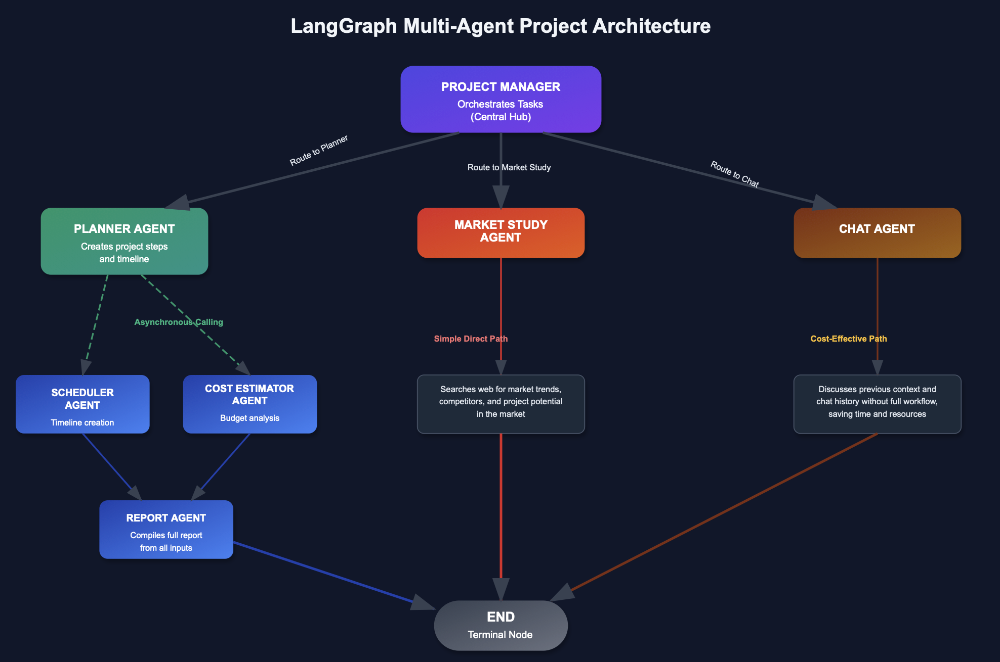

# 🚀 LangGraph Multi-Agent Project Manager

Welcome to the **next generation of intelligent project automation** — a powerful agentic system that turns vague ideas into detailed, actionable plans. Whether you're building a flat, launching a startup, or mapping out a complex project, this system transforms raw intent into structured reports—with cost, time, and market insights—**in seconds**.

This isn’t just a planner.  
It’s your **project co-pilot** — asking the right questions, thinking through every step, and delivering clear results with the precision of an expert team.

---

---
## ✨ Why Project Manager ?

- **Agentic Intelligence**  
  At its core is a sophisticated LangGraph-powered architecture where each agent plays a distinct role. The system is not linear—it’s dynamic. Agents communicate, delegate, and converge asynchronously, mimicking the decision-making process of real teams.

- **FastAPI-Powered REST API**  
  The entire system is wrapped in a sleek, scalable FastAPI interface—ready for integration into your stack, or to serve as a standalone backend.

- **Human-in-the-Loop (HITL)**  
  Unlike rigid systems that break under ambiguity, this one adapts. If your request lacks clarity, the system pauses and **asks smart follow-up questions**—making sure the results are always aligned with your true intent.

- **Asynchronous Planning**  
  Time is money. Once a plan is created, two heavy-lifting agents—**Scheduler** and **Estimator**—kick off **in parallel**, delivering timelines and cost breakdowns faster than traditional pipelines.

- **Chat-First Simplicity**  
  Want to brainstorm ideas without triggering the full system? The **Chat Agent** lets you casually explore, ask questions, or iterate on project ideas—all without burning compute on the full agentic flow.

- **Dockerized & Production-Ready**  
  One command and you’re live. Fully containerized with Docker for fast deployment across any environment—cloud, edge, or local.

---

## 🔍 What It Can Do

- 🏗️ **From Vision to Blueprint**  
  Input a rough description like _“I want to renovate my flat”_, and receive a full plan: tasks, costs, timeline, and market study—delivered as a unified report.

- 💬 **Contextual Conversations**  
  Instead of relying on fixed forms, talk to the system. It understands incomplete inputs and responds like a project consultant.

- 📊 **Market Awareness**  
  The **Market Study Agent** taps into trends and competitor data, giving you real-world awareness before executing your plan.

- 🧾 **Professional Reports**  
  Results from all agents converge into a clean, readable report: fully structured, human-readable, and ready to act on.

---

## 🛠 Deployment & Integration

This system ships with:

- ✅ Docker container support for instant deployment.
- ✅ FastAPI backend with auto-generated OpenAPI docs.
- ✅ YAML-based configuration for custom agent behaviors.

> Want to integrate this into your own platform? Just connect to the REST API endpoints and start feeding it project ideas.

---
# 🚀 How to Use

This system runs on a local LLM using Ollama.

✅ Using Ollama

Make sure you have Ollama installed and running locally. Then, in config.yaml, set the model name you'd like to use—such as "llama3" or "mistral"—and you're ready to go.

🔁 Using a different LLM
If you're not using Ollama, you can easily modify the LLM invocation logic to suit your environment, in the main/main_graph.py.

Head over to main/main_graph.py and replace the LLM client (currently set up with ChatOllama) with your preferred model or API (e.g., OpenAI, Claude, or vLLM).

The rest of the system will continue to work seamlessly.

---
## 🔌 API Usage Example

This project exposes a FastAPI interface. Here's how to interact with it:

## >> Note: 

If your task input is vague or incomplete, the system will pause and ask clarifying questions before continuing. This Human-in-the-Loop step helps ensure accurate planning.

### 📤 POST `/run`

Trigger the agent with a new or existing conversation.

#### ➕ Start a New Thread

```bash
curl -X POST http://localhost:8000/run \
  -H "Content-Type: application/json" \
  -d '{
    "task": "I want to Design a 3-bedroom apartment interior",
    "thread_id": null
  }'
```

**Response:**

```json
{
  "response": "...full project report...",
  "thread_id": "a-unique-id"
}
```

#### 🔁 Continue an Existing Thread

```bash
curl -X POST http://localhost:8000/run \
  -H "Content-Type: application/json" \
  -d '{
    "task": "Add a kitchen renovation step",
    "thread_id": "your-existing-thread-id"
  }'
```

---

### 📥 GET `/state/{thread_id}`

Get the full current internal state of a specific conversation.

```bash
curl http://localhost:8000/state/your-thread-id
```
---
## 🧪 Usage Examples

### ➕ Full Project Planning

Trigger the full flow: from project description → intelligent clarification → plan → schedule & estimation → full report.

---

### 💬 Chat Mode

Perfect for quick Q&A, refining a plan, or just exploring what’s possible—without triggering the full planner.

---

### 🧠 Smart Interruptions

When needed, the system will pause and ask:
> _“Could you clarify the size of the space you want to finish?”_  
> _“What’s your available budget or timeline?”_

These questions ensure you're not just getting a generic result—you’re getting the right one.

---

## 🌟 Built With

- [LangGraph](https://www.langgraph.dev) — Multi-agent workflow engine.
- [FastAPI](https://fastapi.tiangolo.com/) — Modern, high-performance API.
- Python 3.10+
- AsyncIO for concurrency
- Docker for deployment

---

## 📌 Final Words

This project is more than a tech demo—it’s a framework for real-world intelligent automation.

Whether you’re a developer, architect, business owner, or just an idea person, this agentic system gives you the tools to move from thought to execution with clarity, speed, and confidence.

> **Your vision, AI-delivered.**

---
